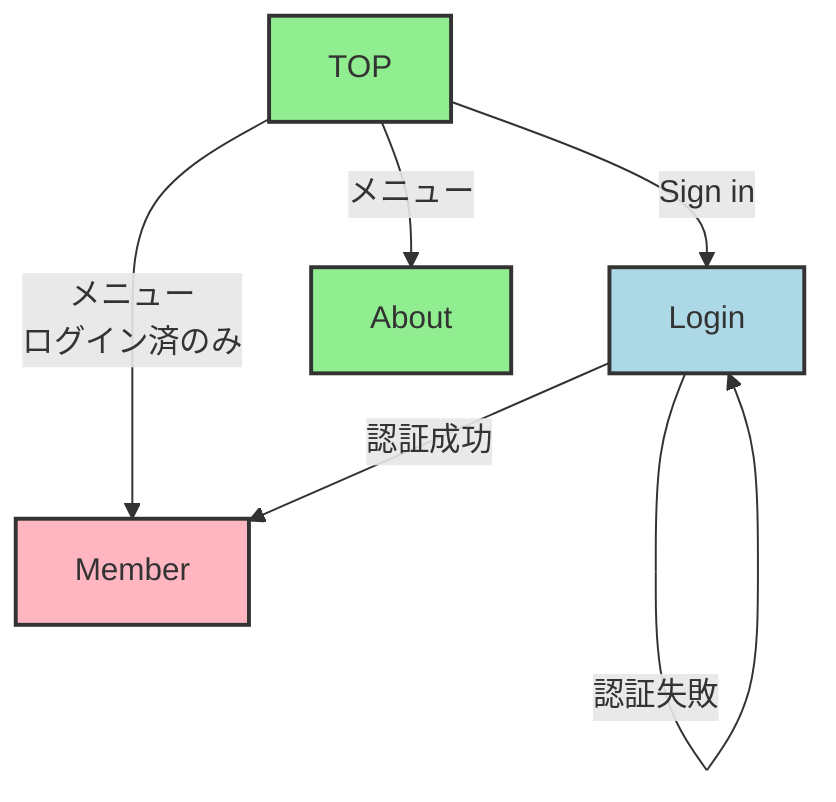

# 画面構成兼遷移図

## 画面遷移図


```mermaid
flowchart TD
    TOP["TOP"] -->|Sign in| COGNITO["Login"]
    TOP -->|メニュー| ABOUT["About"]
    TOP -->|メニュー<br>ログイン済のみ| MEMBER["Member"]
    COGNITO -->|認証成功| MEMBER
    COGNITO -->|認証失敗| COGNITO


    classDef public fill:#90ee90,stroke:#333,stroke-width:2px
    classDef private fill:#ffb6c1,stroke:#333,stroke-width:2px
    classDef auth fill:#add8e6,stroke:#333,stroke-width:2px

    class TOP,ABOUT public
    class MEMBER private
    class COGNITO,TOP_LOGGED auth
```

## 参考URL

https://docs.aws.amazon.com/ja_jp/prescriptive-guidance/latest/patterns/authenticate-react-app-users-cognito-amplify-ui.html

```

```
